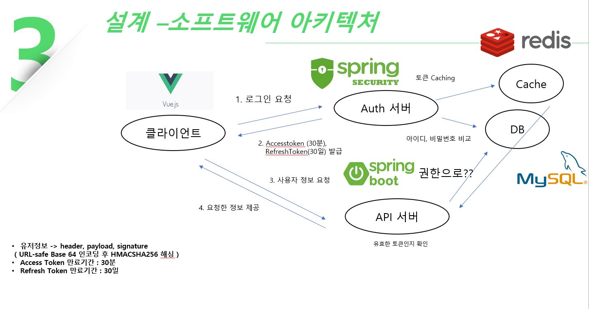

# 인증서버 구현 코드

### Description
 JWT 토큰 인증 방식으로 구현한 인증 서버
 
### Stack
#### Backend
* SpringBoot
* Spring Security
* JPA
* MySQL
* Redis

#### Frontend
* VueJS

### Function
* 유저 로그인
* 유저 로그아웃
* 유저 회원가입
* 유저 권한 별 로직 구현
* 유저 Admin 

## 아키텍처

